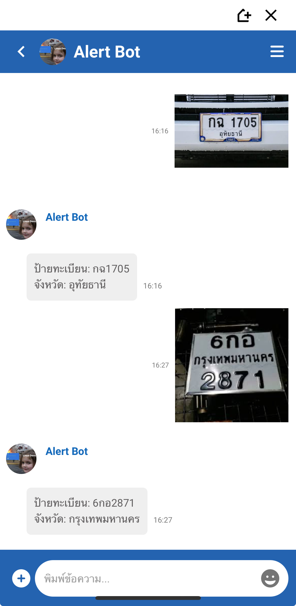

# Webhook for OneChat Bot License Plate Recognition
<!-- using openalpr api (Rekor CarCheck) -->

## Description
This is a webhook for OneChat Bot that uses the openalpr api (Rekor CarCheck) to recognize license plates from images.

## Screenshots
<!-- img size -->
